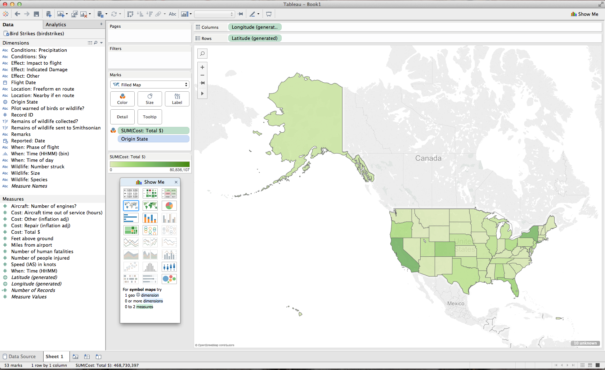
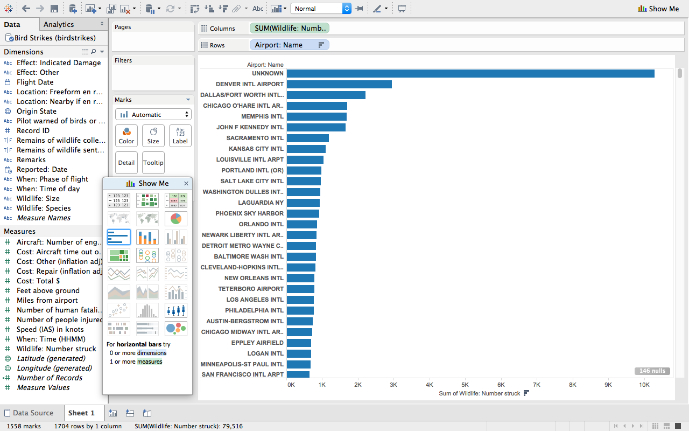
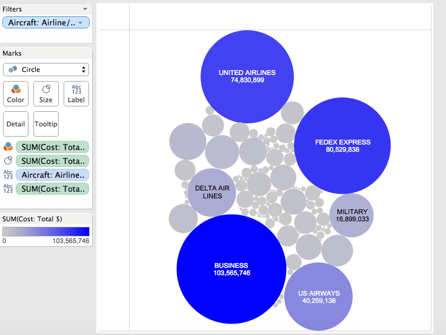
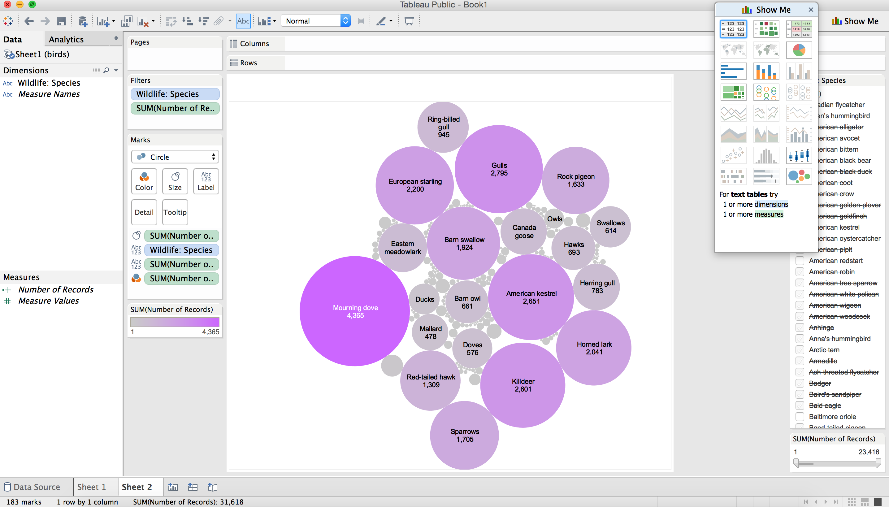
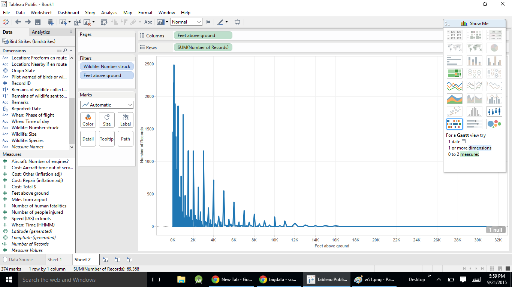

# Report

Using Tableau, create visualization for each question in the report regarding
bird strikes.

# Authors

This report is prepared by
* [Tristan Wagar](www.github.com/twagar95)
* [John Murphy](www.github.com/johnmurph27)
* [Nicole Woytarowicz](www.github.com/nicolele)
* [Satchel Spencer](www.github.com/satchelspencer)
* [Sushant Mittal](www.github.com/sumi6109)

#What states cost the airlines the most money? (Cost and location)

This question was asked by willzfarmer.

Darker colors represent more total cost for a given region.

# Which airport has the highest number struck?

This question was asked by zhya215.

Y-axis shows the name of each airport, while the bar represents the amount of birds hit by each plane that has departed from that airport. The unknown column exists because some reports did not include that in the depart field. 

# Which airlines have the worst luck with birdstrikes in terms of damage caused?

This question was asked by calebhsu.

The largest circles correspond to the airlines that spend the most money on bird strikes. Large airlines spend the most amount on birdstrikes a year typically. 

# What are the top 5 bird species that are involved?

This question was asked by ZachLamb.

The bigger and more darkly shaded circles show which species has a more frequent occurrence in the reports. Certain species with low occurrences have been removed and so have unknown species.

# What is the frequency of bird strikes at various height ranges ?

This question was asked by kari santos.

X axis shows feet above the ground and Y axis show the number of records i.e number of birds hit.The trend shows that as the height decreases, the frequency of hit  also decreases.    
