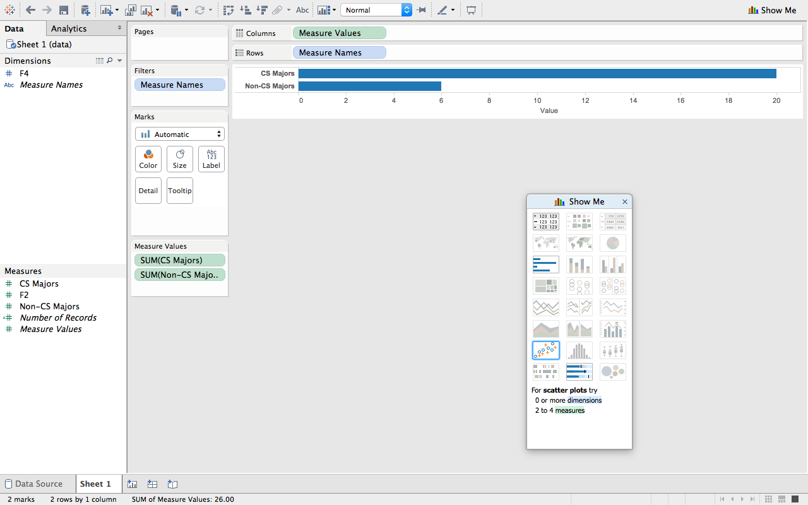
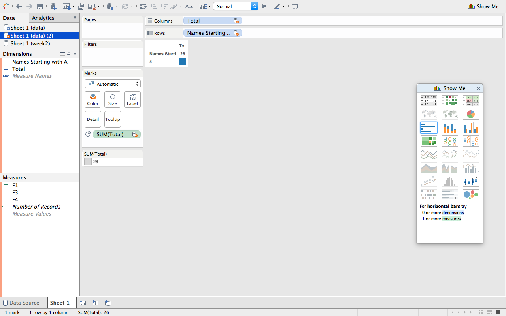
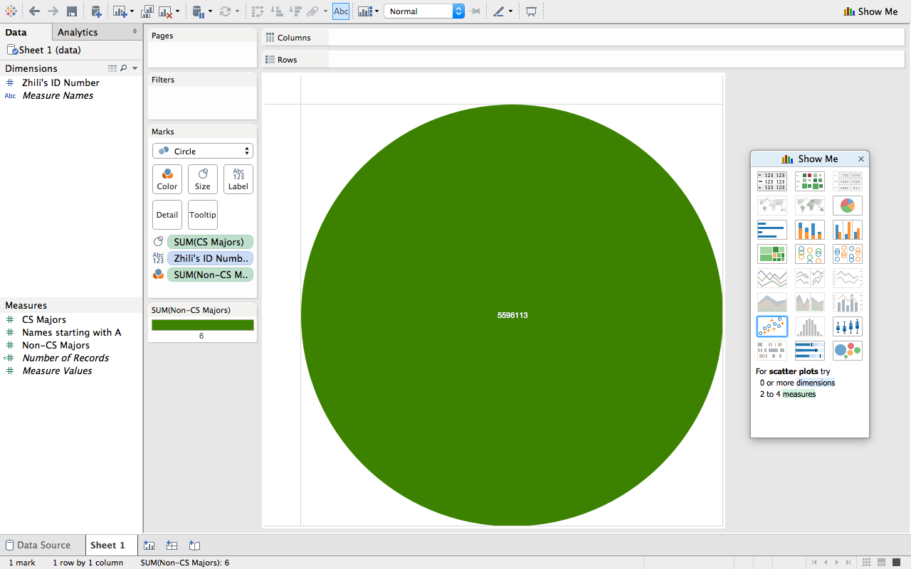

# Tableau Visualization

Tableau is arguably the biggest deal now in terms of data visualization for non-programmers.
Let's pretend you are not a programer. Learn and experience what it is like to make
visualizations using Tableau to answer the same questions about your classmates in our course.

For each of the question, think about what chart you should use to convey your answer and
make your best effort to create something that makes sense to you. There's no right
or wrong. When we meet in the class again, we will set aside time for each team to discuss
and compare the variety of visualization solutions each member has come up with for the
same set of questions. It will be fun!

To include a Tableau visualization in your report, take a screenshot, save it as an image,
put it in the `learning/week2` folder, and replace ``  with
your own image. Please makes sure your screenshot includes the _entire_ Tableau interface
including the controls, widgets ...etc.

# How big the deal Tableau really is?

(write your answer based on the statistics you can find online)

# How many people are in computer science?

If you look at the horizontal bar chart you can see two fields, non-CS and CS majors.
This graph shows the difference between the two. 

# How many people names start with A?

Here you can see a "heat map" of the total number of names and the number of people with a name
starting with A

# How many people aren't in computer science major?

If you look at the horizontal bar chart you can see two fields, non-CS and CS majors.
This graph shows the difference between the two. 

# What is the id number of user zhya215?

Here you can see zhili's ID number in a big green bubble in the center of the screen.
