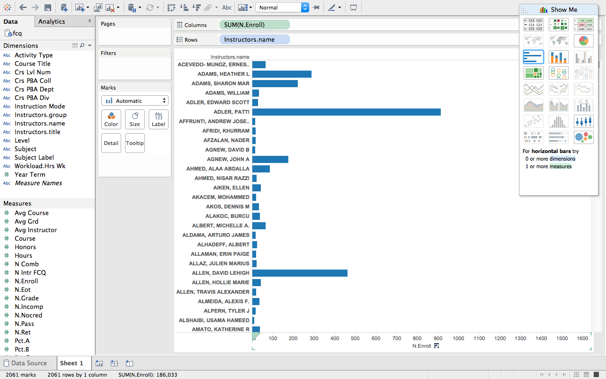
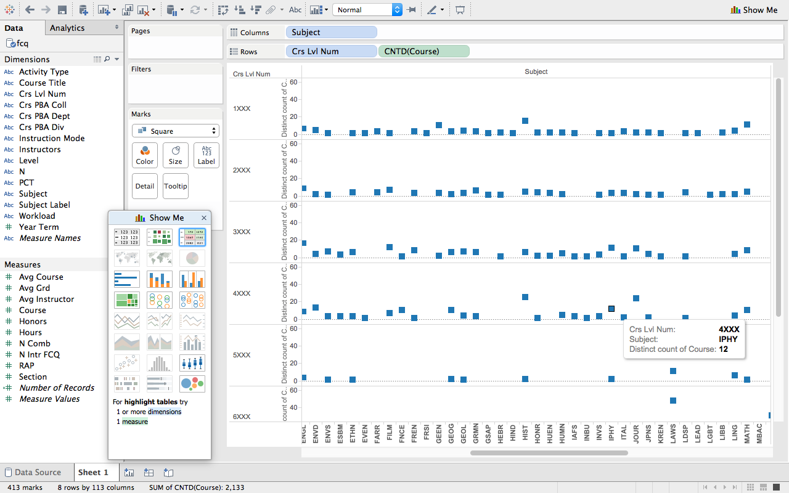
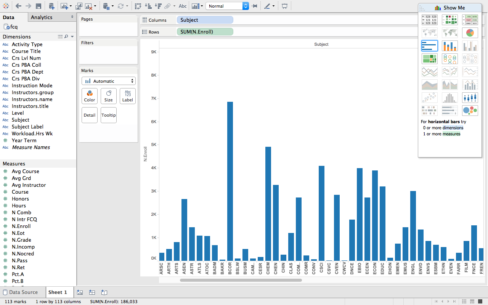

# Visualization

Using Tableau, create visualization for each question in the report. You will
work on this independently just like last week.

To include a Tableau visualization in your report, take a screenshot, save it as an image,
put it in the `learning/week2` folder, and replace ``  with
your own image. Please makes sure your screenshot includes the _entire_ Tableau interface
including the controls, widgets ...etc.

# Import

Data: [fcq.clean.json](https://github.com/bigdatahci2015/book/blob/master/hackathons/fcq/fcq.clean.json)

(a copy of this file is in your book repository already in the directory `hackathons/fcq`)

This dataset is provided to you in the JSON format. Your first task is to figure out
how to transform this JSON file into a format that can be fed into Tableau. As
a junior and senior, you are expected to be able to look around the Internet
to problem solve.

# Which instructor's course has the highest enrollment? by Zhili Yang

Here you can see a self explanatory bar graph that illustrates the point well.

# How many courses in IPHY that has 4 credits hours ? by Fadhil Fath

Here you can see each individual square as a representation of the sum of courses of that level for each department.
Hover over the squares in tableau to analyze the individual numbers. 

# Which departments offer the most 4000 level classes? by Brian McKean

Although my screen was not big enough to display all the departments, PSYC had the highest amount of 4000 level courses.
The bars represent how many courses of each level there are. 

# Which department has the highest enrollment? by Tristan Wagar

Here you can see a self explanatory bar graph that illustrates the point well. 

# What instructor has the highest rating? by Andrew Krodinger

Here you can see the name of the instructor and the rating they have earned.     
